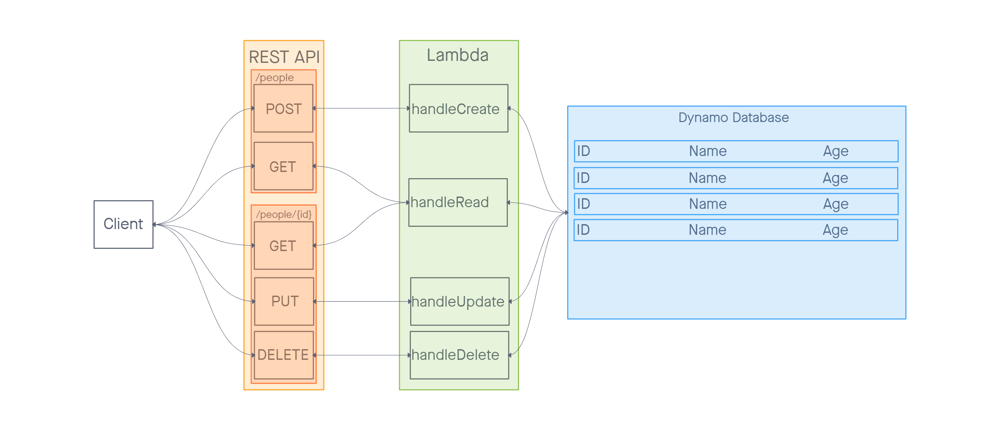

# serverless-api

This repository contains the lambda functions for a serverless API that integrates with a database.

## Root URL

```
https://92nenvszsb.execute-api.us-east-2.amazonaws.com/prod/people
```

## Routes

`/people`

- POST: Creates a new entry; send a JSON body with this format:

  ``` JSON
  {
    "id": "<String>",
    "name": "<String>",
    "age": <Number>
  }
  ```
  
- GET: retrieves all entries in the table

`/people/{id}`

- GET: retrieves a single entry by id
- PUT: updates a single entry by id; send a JSON body with this format:

  ``` JSON
  {
    "name": "<String>",
    "age": <Number>
  }
  ```
  
- DELETE: deletes a single entry by id

## UML


